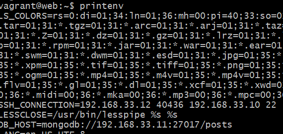

# Ansible database

First create a playbook: ```sudo nano config_mongo_db.yaml or yml```

The following is the yaml code for the file:

```
# Installing required version of mongo db
# hosts entries are already done  - ssh / password authentication is in place

---
# hosts name

- hosts: db

# gather facts (logs)

  gather_facts: yes

# admin access

  become: true

# add instructions / tasks
  tasks:
  - name: setting up mongo db
    apt: pkg=mongodb state=present

# ensure the db is running
```
save and exit

Run the plabook: 

```sudo ansible-playbook config_mongo_db.yaml --ask-vault-pass```

ssh into the db:

``` ssh vagrnat@192.168.33.11```

Then enter the mongodb config file : ```sudo nano /etc/mongodb.conf```

Change the bind ip address to ```0.0.0.0``` and uncomment the line underneath it that says "port"

Save and exit

Restart, enable and check status:

```
sudo systemctl restart mongodb
sudo systemctl enable mongodb
sudo systemctl status mongodb

```
Exit to controller

ssh into web: ```ssh vagrant@192.168.33.10```

Add our environment variable so its persistent with the ```export``` command:

```export DB_HOST=mongodb://192.168.33.11:27017/posts```

Save and exit and refresh the .bashrc file:

```source .bashrc```

Then use ```printenv``` to see if .bashrc was updated correctly:



```cd app```

```node seeds/seed.js```

```npm start```

### Automation

Here are the commands to automate:

```
  tasks:
  - name: Setting up mongo db
    apt: pkg=mongodb state=present

  - name: Change bind ip
    replace:
      path: /etc/mongodb.conf
      regexp: 'bind_ip = 127.0.0.1'
      replace: 'bind_ip = 0.0.0.0'
    become: true

  - name: Uncomment port
    replace:
      path: /etc/mongodb.conf
      regexp: '#port = 27017'
      replace: 'port = 27017'
    become: true

  - name: Restart mongodb
    service:
      name: mongodb
      state: restarted
    become: true

  - name: Enable mongodb
    service:
      name: mongodb
      state: started
      enabled: yes
    become: true

    ```